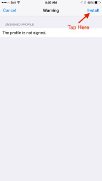
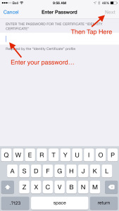
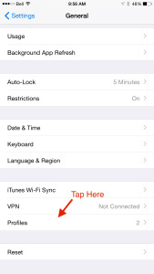
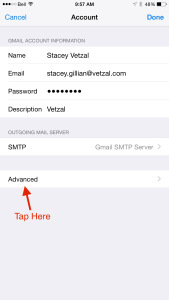
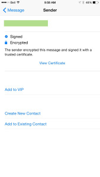
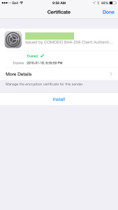
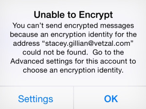
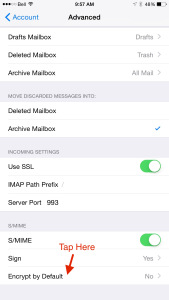
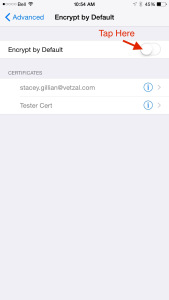

I'm writing this as much for me as I am for you, my fellow netizen.

Signing and encrypting email on iOS is a black art. Get your incense and candles ready.

To start with, I usually use the free email certs from Comodo - https://www.comodo.com/home/email-security/free-email-certificate.php

They're, well, free. That's about all I can say about them.

Each year, when your cert expires, you are issued a new "private key" along with a new certificate. Every fibre of my being screams against this, but hey, most folks don't know how asymmetric cryptography works, so I can forgive most folks for not having this same reaction as I. In my world, your private key is your golden egg. You keep that private, handle it with great care, and never, ever, ever lose it. That private key is your personal identity in digital form.

OK end of rant on that. Moving on.

When you complete Comodo's process, you will download to your computer a file, for some reason they call it CollectCCC.p7s and that's how it hits your downloads folder. This file holds both the private key they just generated for you, and a certificate signed against it issued by Comodo.

On OSX, when you double-click that file it opens up Keychain Access and installs nicely. At that point, Apple Mail is pretty much ready to start signing and decrypting messages from others. In fact, the simplicity here is a bit deceiving because all kinds of things are happening behind the scenes that you might not be aware of, that give you a glimpse at why the h-e-double-hockey-sticks iOS seems convoluted as frak.

In order to get that private key and certificate to iOS you're going to have to do something that I'm still washing off in the shower. You're going to have to email it to yourself.

Here's how:

1. Open your Keychain Access program (it's in Applications / Utilities - I just use Spotlight, command-space and start typing keychain... it'll show up there)
2. Go to Category: Keys and find secure.comodo.com
3. One of them (you may have a few) has an arrow that you can fold down to see your email address certificate. Make sure the certificate isn't an expired one if you've been doing this for a while. And for the love of all that is holy, keep those expired certs and private keys otherwise you won't be able to decrypt messages sent to you in years past!
4. Right-click on the secure.comodo.com listing with the unexpired certificate underneath it, and go to Export "secure.comodo.com". Choose Personal Information Exchange (.p12) which is actually a PKCS12 file. Enter a good password - when it exports, that's your private key all out in the open there for anyone to peek at and steal your identity.

OK, now you're going to have this shiny .p12 file. I hope you're at least using SSL / TLS for SMTP and IMAP/POP, but that's yet another story. Email that file to yourself so you can get it to your iOS device(s).

When that email arrives on your iPhone / iPad / iPod you're going to tap it, and install it. You'll need to enter that password you entered on your Mac, and I do hope it's as inconvenient for you to type as it should be. I fact I also hope you mis-enter it a couple times because it's so complicated. And I really really hope you didn't write it down, and I only kind of hope you had to do this process more than once because you forgot what it was between saving the file and getting that email. I'm not that much of a jerk, very often.

Here's what the screens look like as you install your certificate...

You can verify that the certificate is in place if you go to Settings / General /

Now, go to your Settings, then Mail, Contacts, Calendars, then choose the account for which you had Comodo issue that certificate, then tap Account, tap on Advanced, turn on S/MIME, tap Sign, and make sure your email cert is selected. It's fairly safe to leave Sign to ON and sign all your emails that go out, but once in a while someone may complain about the signature attachment if they don't understand what it is and their email program is dumb and shows it to them.

You might want to encrypt your messages by default, but don't worry - Mail only knows how to encrypt for the people for whom you've explicitly imported signatures... so you won't all of a sudden be sending encrypted email to people that can't read it.

Here are some screenshots of that process:

And now, you're ready to go into Mail. There's a couple gotchas and things that just aren't that obvious.

First is when you get emails from people who have signed and encrypted it, you get these two little symbols - the seal with the checkmark means it's signed (and you can grab their signature - which you have to do before you can send encrypted email), and the lock means it's been encrypted (only you can read it and only  where you've installed your key and certificate).

Email is encrypted specially for each recipient against their signature. If I want to respond to this email, I must install this person's signature. To do so, tap on their name, then tap on View Certificate, then tap Install. Here are some screenshots:

And now, when you're writing an email to someone you can indicate that you want it encrypted. Just tap on their name, and tap the Lock symbol that appears.

If you get the messages below, this is where things get a bit funky:

So what's actually happening here, is it doesn't know what key you want to encrypt the message using, and/or it doesn't have their signature/certificate installed. Make sure you've done the procedure above to install their certificate.

Now, go to your Advanced email settings again, go to Encrypt by Default, turn it on and pick your email address.

Now go to Mail, create a new email to your friend whose signature you've installed, tap their name, and tap the lock symbol again. This should work now.

Now you can go back to your email Advanced settings and turn off Encrypt by Default. You shouldn't have any trouble from here on in.

So there you have it, it's a bit of a complex dance to do this, but once you've done it things should work pretty good for you.

Don't forget to drag that .p12 file to your trash, and empty your trash, and delete that email both from your sent-items on your Mac, and from your inbox (and, of course, empty your email trashes)!

Through the iOS and OSX versions, Apple has tinkered with how this all works a bit, with each release sometimes introducing a new set of quirks, but hopefully this will do us at least until the fall.
