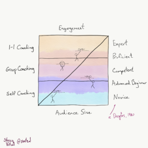
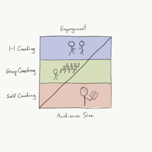
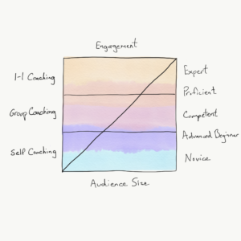
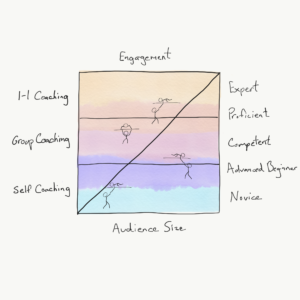

I drew this picture to illustrate a few ideas, and it’s long overdue for an explanation beyond the few folks at whom I’ve stood in front of and waved my arms.

\[caption id="attachment\_437" align="aligncenter" width="300"\] Note to the reader: This isn't a cartesian graph, there is no X and Y axis, despite the way I drew it... In future iterations I will draw the diagonal line from top-left to bottom right to more closely align that interpretation with my intent.\[/caption\]

So let’s decompose it a little, starting with this.

As a coach, or a trainer, or really as a human, we have only so much time in our day. We can choose to spend all day with a single person, divide our day and spend an hour with each of 8 people, or half an hour with 16 people.

So simply put, at the top of the picture you’re spending larger amounts of time with fewer people, and at the bottom of the picture, you’re spending smaller amounts of time with more people.

So we strategize on how to reach more people.

To go beyond a small number of people we have many options, but the easiest can be to group them together. Pack a meeting room or a lecture hall or an online meeting. We are still present, but now we can speak to a wider audience and retain some elements of an interactive conversation.

Our communication style becomes more one way, less interactive, but we can build some understanding of our ideas up in a larger audience.

At the bottom of the picture, we take this to the extreme. We write a book, a blog post, do a webinar, assemble some courseware. We can now speak to our widest audience because each incremental person doesn’t require additional attention. Feedback is limited, and no longer in real-time.

Now let’s layer a learning model on top of it, and this is where it gets interesting. I’m most familiar with [Dreyfus’ model of skills acquisition](https://en.wikipedia.org/wiki/Dreyfus_model_of_skill_acquisition), so I will use that terminology.

I built an Apprenticeship Program at my consultancy as I embedded myself in the Software Craftsmanship movement, and I’m sure you’ll see what I saw if you look around. I remember being so excited when I discovered Dreyfus paper; it fit so well what I saw first-hand.

Consider a Novice. They find themselves in a bind, and they don’t know what to do. They seek an answer, instruction, something actionable. To whom do they go for help?

If they go to an Expert, they might ask “Hey, I see this thing. What do I do?” and the Expert might say, “Hmm. That’s an excellent question. What do you want to do?” The enlightened expert is so far away from the Novice conceptually that there is no bridge for communication. The Novice becomes confused and goes away with little if any direction.

If however, they go to an Advanced Beginner or Competent person, their answer would likely be very different. “Hey, I see this thing. What do I do?” results more often in a response like “I see you’re in situation X, and there are three things we normally do to get from X to Y. Do A, B and then C.” Naturally, the Novice can now act.

Things are this way for many reasons, particularly in the lower rungs of the ladder. When we are only a little higher on the skills ladder, we still have fresh in our minds the challenges we faced at the rung before. Because we can more often relate, our stories resonate and feel more pragmatic; our communication is stronger because of that commonality.

Also, naturally, there are fewer people nearer the top of the picture than nearer the bottom, so we automatically have a system with a distributed means of reaching people effectively at every level. The many Advanced Beginners can teach rules to Novices, for example, as long as their learning path aligns towards the experts’ understanding.

And finally we’re at the full diagram, illustrating people at every level contributing to the overall learning of the system or organization.

It’s poetic, isn’t it?

The same learning model applies to any skill we want to learn. Said another way, every different skill I have falls into this chart. Some things I’m learning, some things I’m teaching.

I wrote before about [exploring farming metaphors in software development](https://codingculture.io/2017/06/26/exploring-farming-metaphors-for-software-development/) and the idea of the Three Sisters. These vegetables, when planted together, reinforce each others’ growth. I believe this same concept exists within many systems.

This symbiosis is why I so firmly believe in the agile notion of cross-functional teams. In most of my seminars, I specifically include a short discussion of the labels we all wear, personally and professionally. I may wear on occasion the label of a “programmer,” or a "coach," but my skills are a mixed box of tools. Pairing me with someone with a slightly different toolset than mine can only strengthen the both of us.

Further, I believe some functions can be very strongly symbiotic - say development and testing, or development and experiential design.

Of course, in the end, this all is in the hands of actual people in your organization. Their willingness to learn or teach. Their desire to be more liquid in the application of themselves to work at hand, to “change hats” if you will, and exercise and build skills that aren’t necessarily defined by their job title.

I talk a lot about culture, but in the words of Steven Pinker, “When culture is seen as an entity with beliefs and desires, the beliefs and desires of actual people are unimportant.”

So to promote this exchange of learning and coaching within your organization, we must ignite within individuals the desire to learn and to share. The desire to collaborate and bring our skills together. Mutual respect and acknowledgment of each other’s expertise and humanity and personal experiences.

In building these sentiments in people and working towards a healthy culture, I believe our challenge becomes primarily to manage negative emotions like fear and shame. People fear being perceived as “lesser” and losing their status, or worse their job. They feel humiliated after making a decision that turns out poorly. These emotions can turn the most honourable motives sour, but alas that is a different topic entirely.
