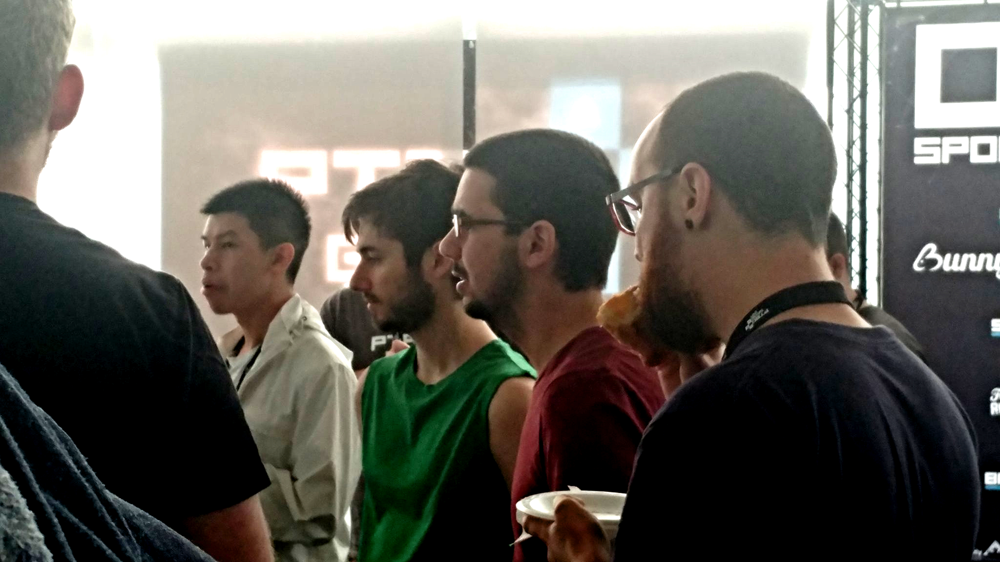

This past weekend, I took part in the [PTBOGameJam03](http://ptbogamejam.com) event in Peterborough, Ontario, an event that has steadily grown since August 2016. In case you don’t know, a Game Jam is an event where people come and work alone or in teams to build a video game, start to finish. Art, sound, code, gameplay, all of it.

And I have to give props to the organizers of PTBOGameJam – bringing in over 60 developers, on a long weekend in August, in Peterborough Ontario (1.5h North East of Toronto) is no small feat!

I’ve written on the theme of social coding many times before, and it is worth repeating. Everywhere I look I see the stereotypical depiction of a software developer. Closed off from the world, socially inept, stick 'em in a back room and slide pizza under the door, don’t let 'em talk to the customers, feed 'em requirements and they churn out code, they’re a “resource” so just hire more of 'em when you need to, and if you can get ’em cheaper elsewhere all the better. I’ve also written a lot about the commoditization of software developers and other creative professionals.

If you have the opportunity to experience a code retreat, or a hackathon, or a game jam, I highly recommend wandering around and watching what goes on.

The culture of a Game Jam is electric. We had people making art, music, writing, 3D models, code, everything game related. All to a driving soundtrack, [live-streamed to the world](https://www.twitch.tv/ptbogamejam/videos/all), for 32 hours straight, 9 AM Saturday morning through 5 PM Sunday afternoon.

As always happens with creative endeavours, people get frustrated, stand up and wander around, look over someone’s shoulder at some code they’re writing, a model they’re building, the artwork they’re drawing, as they move their legs a bit. They pause and comment, “How’d you do that?” “Oh, that’s awesome, I never thought of that!” “I can’t get this to work, do you know anything about…” “Oh, the code’s on Github, check it out.”

So much encouragement, praise, frustration, joy, all these things were alive on the floor at all times. Like I said, the atmosphere is electric.

At the core of this culture, I see the values of the original “Extreme Programming, ” and “Agile” movements lit up and in play. People are working with people, communicating and collaborating to get things done. These values surfaced in the software community because humanity thrives on them, it evolved to do so. It’s in our hearts, this electricity.

Professionally, I have made a career out of drawing these values out of folks and putting them in play. Encouraging people to take part in pair or mob programming, or just to walk over and talk to each other. When that happens, you see a small spark of this electricity take form. It drives the conversation, finds new ideas to old problems. People step outside their comfort zone in the magic and safety of it all to explore and achieve.

When we cut ourselves off from each other, the electricity can’t flow. When we insulate people with walls, or distance, or paper, or process, the electricity drains away. Sure, lots of folks need to retreat to their space, put on some headphones, close the door to get some focus and flow time, but when they open that door or take off their headphones to wander and find inspiration or ask a question, it sparks readily again.

People who denigrate the agile movement by reducing it to the removal of process and the encouragement of chaos, have failed to see the unifying effect of purpose. This past weekend's PTBOGameJam was a testament to how a common goal, community, a seemingly impossible timeline, and a genuine internal desire to achieve brings out greatness in people.

*Photo credit, [Rick Dolishny (@rdolishny)](https://twitter.com/rdolishny)
