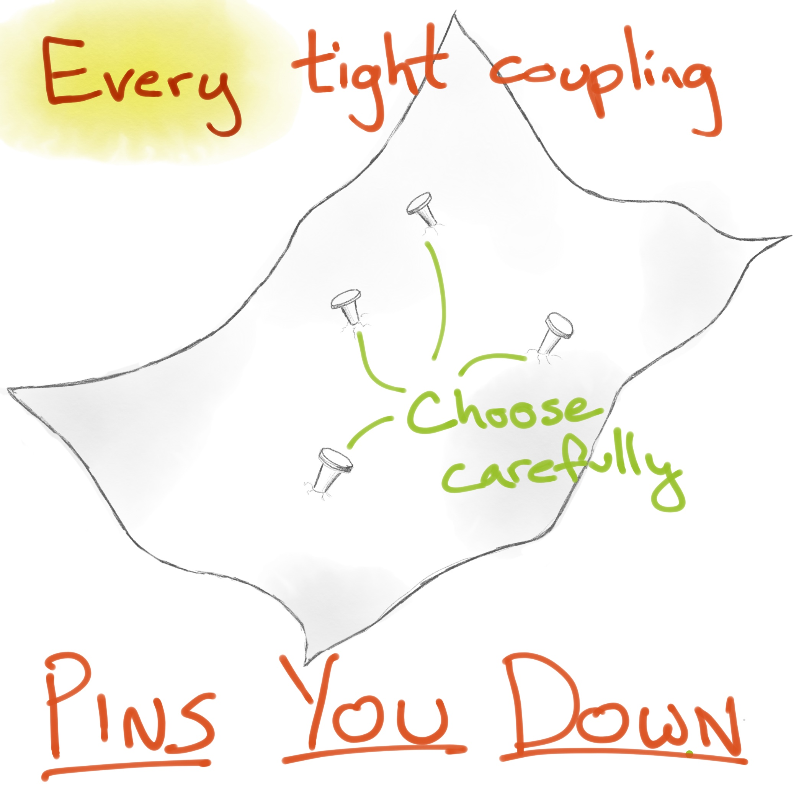
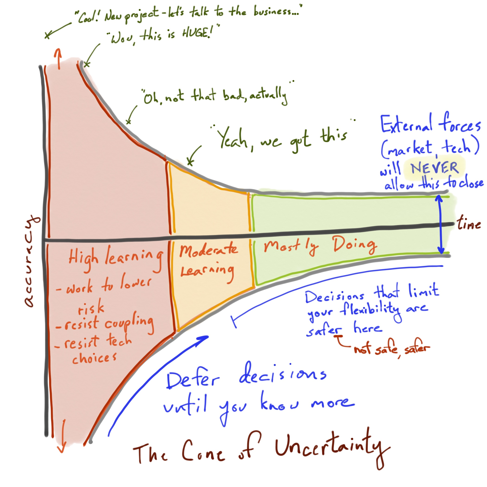

I was talking to a colleague yesterday, smart guy, basically been focusing on systems level architecture and is maneuvering his employer in a good direction. After my session that day on agile technical practices, I'd left their whiteboard cluttered with my stuff and two of my leftover words drew attention and helped him drive his topic a bit more home.

*Tight Coupling.*

Afterwards, he tagged me and brought it up, I mentioned that in my next session I would be talking about the Last Responsible Moment, excited that our work was dovetailing so nicely.

And then he was concerned, and I had to find out the reason for the shift.

Me, "the last responsible moment is when you can't defer a decision to use any particular technology any longer, you know as much as you're going to know about the domain to make the best decision, and delaying any further would cause harm to the product due to the indecision."

Him, "when I've mentioned that before it was interpreted as don't bother abstracting the technology quite yet, we don't yet have the need."

My example left on the board was about refactoring a tight coupling to the Mongoose ORM layer for MongoDB. The idea of removing that tight coupling from the line of business code had resonated.

He had directed the team around an estimation exercise to remove the tight coupling to Mongoose a few weeks earlier. It had resulted in lofty estimates due to the number of individual references to Mongoose. It just seemed like such a big job to update them all.

Here was the surprise, I said that if they'd been following good technical practices, they wouldn't have had the quantity of couplings they saw in their code.

He pushed on the deferring the abstraction point.

I said that deferring the abstraction was likely a violation of the Single Responsibility Principle and a breakdown in cohesion because they were mixing high-level business logic with low-level database calls.

And bang, I gave him the language he needed to further progress what he is trying to accomplish.

Just today, another friend on social media who also does Technical Practices coaching illustrated a scenario where a client was asking for Scrum, and he asked if they needed technical practices help, and the response was basically "no, we're good, we just need help with Scrum."

So he said, "so, they deliver high-quality software with almost no defects that can be delivered to users at any time?"

Crickets.

Somehow the promise of Agile has become that a process framework like Scrum will give the software team what it's missing. The framework will solve what's causing the software team to seemingly misfire. The successful commercialization of Agile has lost the spirit of what it is about and seems far away from its roots in Extreme Programming (XP)..

The process framework is just a process framework, and the breakdowns at the team level may or may not be a result of a process problem.

I will guarantee, however, that a slowdown in feature delivery, a decline in quality, is absolutely a breakdown in technical practices.

If my associate's team had been mindful of concepts like cohesion and the Single Responsibility Principal, if they were practiced in applying them, and if they were following at-the-keyboard disciplines like test-driven development and refactoring, they would not have had such a high occurrence of tight couplings. These would have naturally given way to be refactored into something like, say, the Gateway pattern and had little work to do to replace the technology they no longer wanted.

But as it is, they pushed more technical debt onto the stack with each tight coupling they left behind, and now they need to pay that debt back to make their move.

The Last Responsible Moment is supported by good technical practices, because you are given the possibility of using a simpler or less infrastructure heavy stand-in until you truly need to scale, or adopt a fault tolerance strategy, or adopt a new more capable or compatible 3rd party technology, or whatever is forcing your technology pivot.

So here's my point.

_**If your software team is suffering quality or velocity problems, it**_ **may** _**have something to with process, but it**_ **WILL** _**indicate a breakdown in technical practices.**_

If technical practices aren't on your radar as a component of your agile transformation, you are putting it at risk.

Developers don't "just know" how to code in an agile environment. The pace of change that comes with agile processes can stress their ability to deliver flexible code to the breaking point.

They must learn, practice, receive training and coaching to help them support the whole business in their agile endeavour.

If Agile Technical Practices are not on your radar, your transformation may meet short term success on a new project, but with existing projects and even new projects over time, the growing technical debt will sabotage it.
